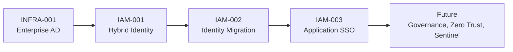

**Building production-inspired IAM, infrastructure, security, and automation labs through OmniVerse Enterprises.**

 

---

# Hiring Manager Start Here

I build enterprise-style identity and infrastructure projects that show how organizations deploy, secure, automate, and operate technology at scale.

My portfolio is organized around **OmniVerse Enterprises**, a fictional company environment used to demonstrate real IAM and systems engineering workflows across Active Directory, Microsoft Entra ID, SAML/OIDC SSO, hybrid identity, PowerShell automation, and governance.

Every major project is written like an engineering handoff: business request, architecture, implementation, validation, troubleshooting, screenshots, scripts, and future enhancements.

## Best Repositories to Review

| Project | What it demonstrates | Start here |
|---|---|---|
| **Enterprise AD Infrastructure** | Windows Server 2022, AD DS, DNS, DHCP, OU design, RBAC groups, 2,000-user provisioning, service accounts, privileged accounts, PowerShell automation | [INFRA-001](https://github.com/KSWISHA9/enterprise-ad-infrastructure) |
| **Hybrid Identity Engineering** | Microsoft Entra Connect, password hash sync, password writeback, OU filtering, source anchor planning, sync validation, hybrid troubleshooting | [IAM-001](https://github.com/KSWISHA9/hybrid-identity-engineering) |
| **Hybrid Identity Migration Engineering** | Identity migration planning and operational hybrid identity work | [IAM-002](https://github.com/KSWISHA9/hybrid-identity-migration-engineering) |
| **Enterprise Application Onboarding & SSO** | SAML 2.0, OIDC, OAuth admin consent, SCIM, claims mapping, certificates, Entra enterprise apps, SSO validation | [IAM-003](https://github.com/KSWISHA9/enterprise-application-onboarding-sso) |

## Portfolio Map

## What I Can Show Quickly

- Build and document Active Directory environments with production-style OU, group, and account design.
- Automate identity provisioning and administration with PowerShell.
- Configure and validate Microsoft Entra Connect hybrid identity.
- Onboard enterprise applications with SAML, OIDC, OAuth, and SCIM patterns.
- Translate technical work into business-ready documentation, validation evidence, and troubleshooting notes.

## Engineering Stack

| Domain | Technologies |
|---|---|
| **Identity & Directory** | Active Directory, Microsoft Entra ID, Entra Connect, Okta, SAML 2.0, OIDC, SCIM |
| **Systems & Infrastructure** | Windows Server, DNS, DHCP, Group Policy, VMware, VirtualBox, Ubuntu |
| **Security & Governance** | Microsoft Defender, Microsoft Sentinel, NIST 800-53, RMF, access reviews, audit logging |
| **Automation** | PowerShell, Microsoft Graph API, Python, Bash |
| **Cloud** | Microsoft Azure, Microsoft 365 |

## Certifications

| Certification | Issuer | Status |
|---|---|---|
| [Security+ SY0-701](https://www.credly.com/earner/earned/share/92b0a760-44a8-42b9-bcf9-4cfed8999b78) | CompTIA | Earned |
| Identity and Access Administrator Associate, SC-300 | Microsoft | Earned |
| SecurityX | CompTIA | In progress |
| Azure Administrator, AZ-104 | Microsoft | Planned |
| Okta Certified Professional | Okta | Planned |

## Current Focus

I am expanding OmniVerse Enterprises into a production-inspired portfolio for identity engineering, infrastructure administration, security operations, automation, and governance.

Current work focuses on:

- Conditional Access and Zero Trust scenarios
- Joiner-Mover-Leaver automation
- Microsoft Graph identity automation
- Identity Governance and Privileged Identity Management
- Microsoft Sentinel monitoring and detection use cases

---

**Open to IAM, Systems Administration, Cloud Identity, and Security Engineering opportunities.**

